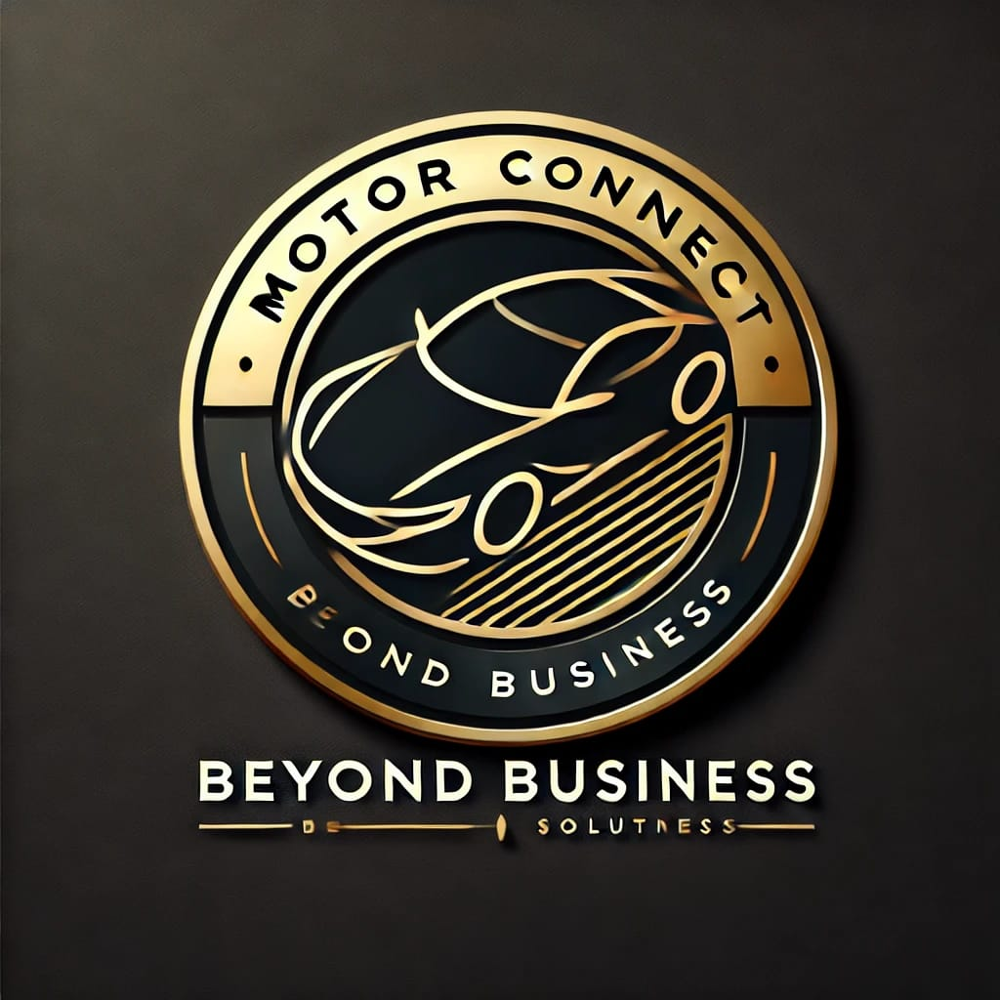

## 🚗 Motor Connect  

Welcome to the **Motor Connect** repository! This project represents our commitment to delivering seamless, innovative, and sustainable mobility solutions. 



### 🌟 About Motor Connect  

Motor Connect is more than just a car dealership—we are your **trusted partner in effortless mobility**. We connect individuals and businesses with personalized automotive solutions, from **car sales and rentals** to **chauffeuring, financing, and insurance services**.  

### 🎯 Our Mission  

We are dedicated to:  
- Delivering **cutting-edge mobility solutions** through technology and personalized service.  
- Simplifying access to **vehicle sales, rentals, chauffeuring, financing, and insurance**.  
- Promoting **sustainability, affordability, and innovation** to create lasting value for our customers and communities.  
- Ensuring **trust, reliability, and excellence** in every customer interaction.  

### 🚀 Our Vision  

*"Transforming mobility with innovative, seamless, and sustainable solutions that empower individuals and businesses, enhancing the driving experience for all."*  

### 🏆 Core Values  
✅ **Customer-Centric Approach** – We prioritize customer needs and satisfaction.  
✅ **Innovation & Excellence** – We embrace cutting-edge technology and top-tier service.  
✅ **Sustainability & Responsibility** – We promote eco-friendly and affordable mobility solutions.  
✅ **Integrity & Trust** – Our customers trust us for transparent, honest dealings.  
✅ **Affordability & Accessibility** – Quality services at competitive prices.  
✅ **Collaboration & Teamwork** – Building strong relationships with customers and partners.  

### 🚘 Our Services  
- **Car Sales**: Find the perfect new or pre-owned vehicle for your needs.  
- **Car Hire & Chauffeuring**: Flexible rental options and luxury travel services.  
- **Financing Solutions**: Tailored financial plans to make car ownership easier.  
- **Insurance Services**: Comprehensive coverage at the best prices.  

### 📂 Repository Structure  

```
📁 Motor-Connect
│── 📁 assets         # Images, logos, and media files
│── 📁 src           # Website source code
│── 📁 docs          # Documentation and guides
│── 📄 index.html     # Main landing page
│── 📄 README.md      # This file
│── 📄 LICENSE        # License information
│── 📄 CONTRIBUTING.md # Contribution guidelines
```

### 🌍 Connect with Us  

📧 **Email**: [info@motorconnect.co.za](mailto:info@motorconnect.co.za)  
🌐 **Website**: [www.motorconnect.co.za](https://www.motorconnect.co.za)  
📞 **Phone**: +27 72 190 5700  
📱 **Social Media**: [@motorconnectza](https://www.instagram.com/motorconnectza)  

### 🤝 Contributing  

We welcome contributions from the community! Please check out our [CONTRIBUTING.md](CONTRIBUTING.md) for guidelines on how to get started.  

### 📜 License  

This project is licensed under the **MIT License** – see the [LICENSE](LICENSE) file for details.  

🚀 **Experience the Future of Mobility with Motor Connect!** 🚗✨

---

# Templete Used
  =>  Template Name    : Cental - Car Rent Website Template

  =>  Template Link    : https://htmlcodex.com/car-rent-website-template

  =>  Template License : https://htmlcodex.com/license (or read the LICENSE.txt file)

  =>  Template Author  : HTML Codex

  =>  Author Website   : https://htmlcodex.com
